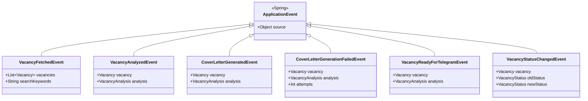

# Архитектура HH Assistant

## Краткое описание

HH Assistant - это event-driven приложение для автоматического поиска и анализа вакансий на HH.ru с использованием локальной LLM (Ollama) и отправкой релевантных вакансий в Telegram.

### Ключевые особенности архитектуры:

- **Event-Driven**: Компоненты взаимодействуют через Spring Events
- **Single Responsibility**: Каждый сервис выполняет одну задачу
- **Async Processing**: Асинхронная обработка через `@Async`
- **Queue-Based**: In-memory очередь для генерации сопроводительных писем
- **Caching**: Кэширование данных для производительности

## Общая схема системы

```mermaid
graph TB
    subgraph "External Services"
        HH[HH.ru API]
        OLLAMA[Ollama LLM]
        TG[Telegram Bot API]
    end

    subgraph "Spring Boot Application"
        subgraph "Controllers"
            SCHED[VacancySchedulerService<br/>@Scheduled]
            MGMT[VacancyManagementController<br/>REST API]
            OAUTH[OAuthController]
        end

        subgraph "Event Bus"
            EB[ApplicationEventPublisher<br/>Spring Events]
        end

        subgraph "Core Services"
            VF[VacancyFetchService<br/>Получение вакансий]
            VA[VacancyAnalysisService<br/>Анализ релевантности]
            CLQ[CoverLetterQueueService<br/>Очередь генерации писем]
            VN[VacancyNotificationService<br/>Отправка в Telegram]
            VS[VacancyStatusService<br/>Управление статусами]
        end

        subgraph "Supporting Services"
            VSVC[VacancyService<br/>CRUD операции]
            RS[ResumeService<br/>Кэш резюме]
            NS[NotificationService<br/>Системные уведомления]
            TRS[TokenRefreshService<br/>Обновление токенов]
        end

        subgraph "Clients"
            HHC[HHVacancyClient<br/>WebClient]
            HHRC[HHResumeClient<br/>WebClient]
            OC[OllamaClient<br/>WebClient]
            TC[TelegramClient<br/>WebClient]
        end

        subgraph "Data Layer"
            DB[(PostgreSQL<br/>Liquibase)]
            REPO[Repositories<br/>JPA]
        end
    end

    %% External connections
    HHC --> HH
    HHRC --> HH
    OC --> OLLAMA
    TC --> TG

    %% Controller to Services
    SCHED --> VF
    SCHED --> VA
    SCHED --> VS
    MGMT --> VSVC
    MGMT --> VS

    %% Event flow
    VF -->|publishes| EB
    VA -->|publishes| EB
    CLQ -->|publishes| EB
    VS -->|publishes| EB
    
    EB -->|listens| VN
    EB -->|listens| CLQ

    %% Service dependencies
    VF --> HHC
    VF --> VSVC
    VF --> TRS
    VF --> NS
    
    VA --> OC
    VA --> RS
    VA --> CLQ
    
    CLQ --> VA
    CLQ --> VS
    CLQ --> RS
    
    VN --> TC
    VN --> VS
    
    VS --> REPO
    VSVC --> REPO
    REPO --> DB

    style VF fill:#e1f5ff
    style VA fill:#e1f5ff
    style CLQ fill:#e1f5ff
    style VN fill:#e1f5ff
    style VS fill:#e1f5ff
    style EB fill:#fff4e1
```

## Поток обработки вакансии


## Структура событий



## Компоненты и их ответственность

### Event-Driven Services

| Сервис | Ответственность | Публикует события | Слушает события |
|--------|-----------------|-------------------|-----------------|
| `VacancyFetchService` | Получение вакансий от HH.ru API | `VacancyFetchedEvent` | - |
| `VacancyAnalysisService` | Анализ релевантности через LLM | `VacancyAnalyzedEvent` | - |
| `CoverLetterQueueService` | Очередь генерации сопроводительных писем | `CoverLetterGeneratedEvent`, `CoverLetterGenerationFailedEvent`, `VacancyReadyForTelegramEvent` | - |
| `VacancyNotificationService` | Отправка уведомлений в Telegram | - | `VacancyReadyForTelegramEvent` |
| `VacancyStatusService` | Управление статусами вакансий | `VacancyStatusChangedEvent` | - |

### Supporting Services

| Сервис | Ответственность |
|--------|-----------------|
| `VacancyService` | CRUD операции с вакансиями, кэширование |
| `ResumeService` | Загрузка и кэширование резюме |
| `NotificationService` | Системные уведомления (старт, ошибки) |
| `TokenRefreshService` | Автоматическое обновление токенов HH.ru |
| `VacancySchedulerService` | Планировщик задач (cron) |

### Clients

| Клиент | Назначение |
|--------|-----------|
| `HHVacancyClient` | Поиск и получение вакансий от HH.ru API |
| `HHResumeClient` | Получение резюме от HH.ru API |
| `OllamaClient` | Взаимодействие с локальной LLM (Ollama) |
| `TelegramClient` | Отправка сообщений в Telegram Bot API |

## Технологический стек

- **Backend**: Kotlin 1.9+ + Spring Boot 3.2+
- **Event Bus**: Spring ApplicationEventPublisher
- **Database**: PostgreSQL 16 + Liquibase
- **AI/LLM**: Ollama (Qwen 2.5 7B)
- **HTTP Client**: Spring WebClient (Reactive)
- **Caching**: Spring Cache + Caffeine
- **Scheduling**: Spring @Scheduled
- **Async Processing**: Spring @Async

## Принципы архитектуры

1. **Event-Driven Architecture**: Компоненты взаимодействуют через события
2. **Single Responsibility**: Каждый сервис отвечает за одну задачу
3. **Loose Coupling**: Слабая связанность через события
4. **Separation of Concerns**: Разделение бизнес-логики и инфраструктуры
5. **Rich Domain Model**: Доменные сущности содержат бизнес-логику

