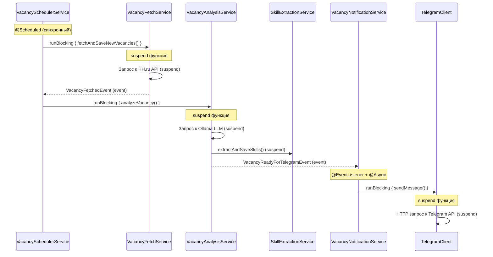

# Архитектурная диаграмма проекта HH Assistant

## Обзор архитектуры

Проект использует гибридную архитектуру:
- **Синхронные взаимодействия**: REST API контроллеры → сервисы
- **Асинхронные корутины**: для I/O операций (API запросы, LLM вызовы)
- **Event-driven**: для слабосвязанной коммуникации между сервисами
- **Scheduled задачи**: для периодических операций

## Диаграмма взаимодействий

```mermaid
graph TB
    %% Внешние системы
    HH_API[HH.ru API]
    OLLAMA[Ollama LLM]
    TELEGRAM_API[Telegram API]
    DB[(PostgreSQL)]
    
    %% REST Controllers (Синхронные)
    subgraph "REST API Layer (Синхронный)"
        VAC_CTRL[VacancyManagementController]
        SKILL_CTRL[SkillStatisticsController]
        OAUTH_CTRL[OAuthController]
    end
    
    %% Telegram Layer
    subgraph "Telegram Layer"
        TELEGRAM_POLL[TelegramPollingService<br/>@Scheduled]
        TELEGRAM_CMD[TelegramCommandHandler<br/>suspend]
        TELEGRAM_CLIENT[TelegramClient<br/>suspend]
    end
    
    %% Scheduled Services
    subgraph "Scheduled Services (Синхронный → Корутины)"
        SCHEDULER[VacancySchedulerService<br/>@Scheduled<br/>runBlocking]
        CLEANUP[VacancyCleanupService<br/>@Scheduled<br/>runBlocking]
    end
    
    %% Core Services (Смешанные: синхронные + корутины)
    subgraph "Core Services"
        FETCH[VacancyFetchService<br/>publishEvent]
        ANALYSIS[VacancyAnalysisService<br/>suspend + publishEvent]
        SKILL_EXTRACT[SkillExtractionService<br/>suspend]
        SKILL_STATS[SkillStatisticsService<br/>синхронный]
        VAC_SERVICE[VacancyService<br/>синхронный]
        STATUS_SERVICE[VacancyStatusService<br/>publishEvent]
    end
    
    %% Event Listeners (Асинхронные через @Async)
    subgraph "Event Listeners (@Async)"
        NOTIF_SERVICE[VacancyNotificationService<br/>@EventListener + @Async]
        COVER_LETTER[CoverLetterQueueService<br/>@EventListener]
    end
    
    %% Clients (Корутины)
    subgraph "External Clients (suspend)"
        HH_CLIENT[HHVacancyClient<br/>suspend]
        OLLAMA_CLIENT[OllamaClient<br/>suspend]
        TELEGRAM_CLIENT_IMPL[TelegramClient<br/>suspend]
    end
    
    %% Repositories
    subgraph "Data Layer"
        REPOS[Repositories<br/>JPA]
    end
    
    %% Синхронные взаимодействия (сплошные линии)
    VAC_CTRL -->|синхронный| VAC_SERVICE
    VAC_CTRL -->|синхронный| STATUS_SERVICE
    SKILL_CTRL -->|синхронный| SKILL_STATS
    OAUTH_CTRL -->|синхронный| VAC_SERVICE
    
    %% Корутины (пунктирные линии)
    SCHEDULER -.->|runBlocking| FETCH
    SCHEDULER -.->|runBlocking| ANALYSIS
    SCHEDULER -.->|runBlocking| SKILL_EXTRACT
    CLEANUP -.->|runBlocking| HH_CLIENT
    
    TELEGRAM_POLL -.->|runBlocking| TELEGRAM_CMD
    TELEGRAM_CMD -.->|suspend| TELEGRAM_CLIENT
    
    ANALYSIS -.->|suspend| OLLAMA_CLIENT
    ANALYSIS -.->|suspend| SKILL_EXTRACT
    SKILL_EXTRACT -.->|suspend| HH_CLIENT
    SKILL_EXTRACT -.->|suspend| OLLAMA_CLIENT
    
    FETCH -.->|suspend| HH_CLIENT
    NOTIF_SERVICE -.->|runBlocking| TELEGRAM_CLIENT_IMPL
    
    %% Event-driven (волнистые линии)
    FETCH ==>|VacancyFetchedEvent| ANALYSIS
    ANALYSIS ==>|VacancyAnalyzedEvent| COVER_LETTER
    ANALYSIS ==>|VacancyReadyForTelegramEvent| NOTIF_SERVICE
    STATUS_SERVICE ==>|VacancyStatusChangedEvent| COVER_LETTER
    
    %% Внешние API
    HH_CLIENT -.->|suspend HTTP| HH_API
    OLLAMA_CLIENT -.->|suspend HTTP| OLLAMA
    TELEGRAM_CLIENT_IMPL -.->|suspend HTTP| TELEGRAM_API
    
    %% Database
    VAC_SERVICE -->|JPA| REPOS
    SKILL_STATS -->|JPA| REPOS
    STATUS_SERVICE -->|JPA| REPOS
    FETCH -->|JPA| REPOS
    REPOS -->|JDBC| DB
    
    %% Стили
    classDef sync fill:#e1f5ff,stroke:#01579b,stroke-width:2px
    classDef coroutine fill:#fff3e0,stroke:#e65100,stroke-width:2px
    classDef event fill:#f3e5f5,stroke:#4a148c,stroke-width:2px
    classDef scheduled fill:#e8f5e9,stroke:#1b5e20,stroke-width:2px
    classDef external fill:#ffebee,stroke:#b71c1c,stroke-width:2px
    
    class VAC_CTRL,SKILL_CTRL,OAUTH_CTRL,VAC_SERVICE,SKILL_STATS,STATUS_SERVICE sync
    class TELEGRAM_CMD,ANALYSIS,SKILL_EXTRACT,HH_CLIENT,OLLAMA_CLIENT,TELEGRAM_CLIENT_IMPL coroutine
    class NOTIF_SERVICE,COVER_LETTER,FETCH,ANALYSIS,STATUS_SERVICE event
    class SCHEDULER,CLEANUP,TELEGRAM_POLL scheduled
    class HH_API,OLLAMA,TELEGRAM_API,DB external
```

## Легенда

- **Сплошные линии (→)**: Синхронные вызовы (блокирующие)
- **Пунктирные линии (-.->)**: Асинхронные вызовы через корутины (suspend функции)
- **Волнистые линии (==>)**: Event-driven взаимодействия (Spring Events)

## Типы взаимодействий

### 1. Синхронные взаимодействия (REST API)

**Где используется:**
- `VacancyManagementController` → `VacancyService`
- `SkillStatisticsController` → `SkillStatisticsService`
- `OAuthController` → сервисы

**Характеристики:**
- Блокирующие вызовы
- Прямая зависимость между компонентами
- Простота отладки и понимания потока выполнения
- HTTP запрос ждёт ответа

**Пример:**
```kotlin
@GetMapping("/unviewed")
fun getUnviewedVacancies(): ResponseEntity<Map<String, Any>> {
    val vacancies = vacancyService.getUnviewedVacancies() // Синхронный вызов
    return ResponseEntity.ok(mapOf("vacancies" to vacancies))
}
```

### 2. Асинхронные корутины (suspend функции)

**Где используется:**
- `VacancyAnalysisService.analyzeVacancy()` - анализ через LLM
- `SkillExtractionService.extractAndSaveSkills()` - извлечение навыков
- `HHVacancyClient.getVacancyDetails()` - запросы к HH.ru API
- `OllamaClient.chat()` - запросы к LLM
- `TelegramClient.sendMessage()` - отправка сообщений

**Характеристики:**
- Неблокирующие вызовы
- Эффективное использование потоков
- Structured concurrency (автоматическая отмена дочерних корутин)
- Используется для I/O операций (сеть, БД)

**Пример:**
```kotlin
suspend fun analyzeVacancy(vacancy: Vacancy): VacancyAnalysis {
    // Неблокирующий вызов LLM
    val response = ollamaClient.chat(messages)
    // Обработка ответа
}
```

**Мост синхронный → корутины:**
```kotlin
@Scheduled(cron = "...")
fun checkNewVacancies() {
    runBlocking { // Преобразует синхронный контекст в корутины
        val result = vacancyFetchService.fetchAndSaveNewVacancies() // suspend функция
    }
}
```

### 3. Event-driven архитектура (Spring Events)

**Где используется:**
- `VacancyFetchService` → публикует `VacancyFetchedEvent`
- `VacancyAnalysisService` → публикует `VacancyAnalyzedEvent`, `VacancyReadyForTelegramEvent`
- `VacancyStatusService` → публикует `VacancyStatusChangedEvent`
- `VacancyNotificationService` → слушает `VacancyReadyForTelegramEvent` (@EventListener + @Async)
- `CoverLetterQueueService` → слушает события

**Характеристики:**
- Слабая связанность компонентов
- Асинхронная обработка через `@Async`
- Возможность множественных подписчиков
- Отсутствие прямых зависимостей между издателем и подписчиками

**Пример:**
```kotlin
// Издатель
eventPublisher.publishEvent(VacancyReadyForTelegramEvent(this, vacancy, analysis))

// Подписчик
@EventListener
@Async
fun handleVacancyReadyForTelegram(event: VacancyReadyForTelegramEvent) {
    sendVacancyToTelegram(event.vacancy, event.analysis)
}
```

### 4. Scheduled задачи

**Где используется:**
- `VacancySchedulerService.checkNewVacancies()` - периодическая проверка вакансий
- `VacancyCleanupService.cleanupNonExistentVacancies()` - очистка несуществующих вакансий
- `TelegramPollingService` - опрос Telegram API

**Характеристики:**
- Запускаются по расписанию (cron)
- Используют `runBlocking` для вызова suspend функций
- Синхронный контекст → корутины

## Поток обработки вакансии



## Недостатки Event-Oriented архитектуры vs MVC

### 1. **Сложность отладки и трассировки**

**Event-driven:**
- ❌ Сложно отследить полный путь выполнения
- ❌ Нет явного стека вызовов
- ❌ События могут обрабатываться в произвольном порядке
- ❌ Сложно понять, кто обработал событие и в каком порядке

**MVC:**
- ✅ Явный стек вызовов
- ✅ Легко поставить breakpoint и пройти по коду
- ✅ Понятная последовательность выполнения

**Пример проблемы:**
```kotlin
// Event-driven: непонятно, кто обработает событие и когда
eventPublisher.publishEvent(VacancyReadyForTelegramEvent(...))
// Где обработается? Когда? В каком порядке, если несколько слушателей?
```

```kotlin
// MVC: явный вызов, видно в стеке
notificationService.sendVacancyToTelegram(vacancy, analysis)
```

### 2. **Отсутствие гарантий обработки**

**Event-driven:**
- ❌ Если слушатель упал, событие теряется
- ❌ Нет гарантии, что событие будет обработано
- ❌ Сложно реализовать retry механизм
- ❌ Нет транзакционности между издателем и подписчиками

**MVC:**
- ✅ Если вызов упал, можно обработать исключение
- ✅ Можно реализовать retry на уровне вызова
- ✅ Транзакционность через `@Transactional`

**Пример проблемы:**
```kotlin
// Event-driven: если слушатель упал, событие потеряно
@EventListener
@Async
fun handleEvent(event: VacancyReadyForTelegramEvent) {
    throw RuntimeException("Ошибка!") // Событие потеряно, нет retry
}
```

```kotlin
// MVC: можно обработать ошибку и повторить
try {
    notificationService.sendVacancyToTelegram(vacancy, analysis)
} catch (e: Exception) {
    // Retry логика
    retryService.retry { notificationService.sendVacancyToTelegram(...) }
}
```

### 3. **Тестирование**

**Event-driven:**
- ❌ Сложно тестировать изолированно
- ❌ Нужно мокать `ApplicationEventPublisher`
- ❌ Сложно проверить, что событие было опубликовано
- ❌ Нужно проверять асинхронную обработку

**MVC:**
- ✅ Легко мокать зависимости
- ✅ Прямые вызовы методов
- ✅ Синхронное выполнение в тестах

**Пример:**
```kotlin
// Event-driven: сложное тестирование
@Test
fun testVacancyAnalysis() {
    // Нужно проверить, что событие было опубликовано
    verify(eventPublisher).publishEvent(any(VacancyReadyForTelegramEvent::class.java))
    // Но как проверить, что оно было обработано? Нужно ждать @Async
}
```

```kotlin
// MVC: простое тестирование
@Test
fun testVacancyAnalysis() {
    val result = vacancyAnalysisService.analyzeVacancy(vacancy)
    verify(notificationService).sendVacancyToTelegram(vacancy, result)
}
```

### 4. **Производительность и ресурсы**

**Event-driven:**
- ❌ Дополнительные потоки для `@Async`
- ❌ Накладные расходы на создание событий
- ❌ Потенциальные проблемы с памятью (накопление событий)
- ❌ Сложнее контролировать нагрузку

**MVC:**
- ✅ Прямой контроль над потоком выполнения
- ✅ Меньше накладных расходов
- ✅ Проще контролировать ресурсы

### 5. **Понимание бизнес-логики**

**Event-driven:**
- ❌ Бизнес-логика размазана по слушателям событий
- ❌ Сложно понять полный flow обработки
- ❌ Нужно искать все `@EventListener` для понимания

**MVC:**
- ✅ Бизнес-логика в одном месте (сервис)
- ✅ Понятный flow выполнения
- ✅ Легко читать и поддерживать

### 6. **Обработка ошибок**

**Event-driven:**
- ❌ Ошибки в слушателях не видны издателю
- ❌ Сложно реализовать общую обработку ошибок
- ❌ Нет явного способа вернуть ошибку издателю

**MVC:**
- ✅ Ошибки возвращаются явно
- ✅ Можно использовать `@ControllerAdvice` для обработки
- ✅ Понятная обработка исключений

## Когда использовать Event-driven?

**Event-driven подходит для:**
- ✅ Слабо связанных компонентов
- ✅ Множественных подписчиков на одно событие
- ✅ Фоновых задач (уведомления, логирование, метрики)
- ✅ Когда не нужна гарантия обработки

**MVC подходит для:**
- ✅ Основной бизнес-логики
- ✅ Когда нужна гарантия выполнения
- ✅ Когда важна транзакционность
- ✅ Когда нужна простота отладки

## Рекомендации для проекта

В текущем проекте event-driven используется **правильно** для:
- Уведомлений (`VacancyNotificationService`) - фоновые задачи
- Очереди генерации писем (`CoverLetterQueueService`) - слабая связанность

Но можно улучшить:
- Добавить обработку ошибок в event listeners
- Добавить retry механизм для критичных событий
- Добавить логирование всех событий для отладки
- Рассмотреть использование Spring Cloud Stream для гарантированной доставки

## Сравнительная таблица

| Критерий | Event-Driven | MVC |
|----------|--------------|-----|
| Связанность | Слабая | Сильная |
| Отладка | Сложная | Простая |
| Тестирование | Сложное | Простое |
| Гарантия выполнения | Нет | Есть |
| Транзакционность | Сложно | Просто |
| Производительность | Накладные расходы | Эффективно |
| Понимание кода | Сложно | Просто |
| Обработка ошибок | Сложно | Просто |

## Выводы

**Event-driven архитектура** имеет место в проекте для:
- Фоновых задач (уведомления)
- Слабо связанных компонентов
- Множественных подписчиков

**Но для основной бизнес-логики лучше использовать MVC:**
- Явные вызовы
- Гарантия выполнения
- Простота отладки и тестирования
- Понятный flow выполнения

**Идеальный баланс:** Гибридный подход (как в проекте):
- MVC для основной логики
- Event-driven для фоновых задач и уведомлений
- Корутины для асинхронных I/O операций

